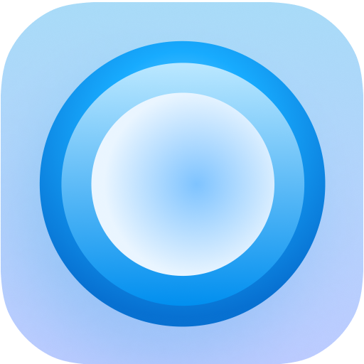

  

<h1 align="center"><b><a href="https://github.com/capsoftware/cap/">Cap</a> for Raycast</b></h1>

Currently supports:
- Start a new recording with selected input devices
- Stop any running recording
- Open your Cap account's Dashboard

*_Requires [Cap Desktop](https://cap.so/download)_

